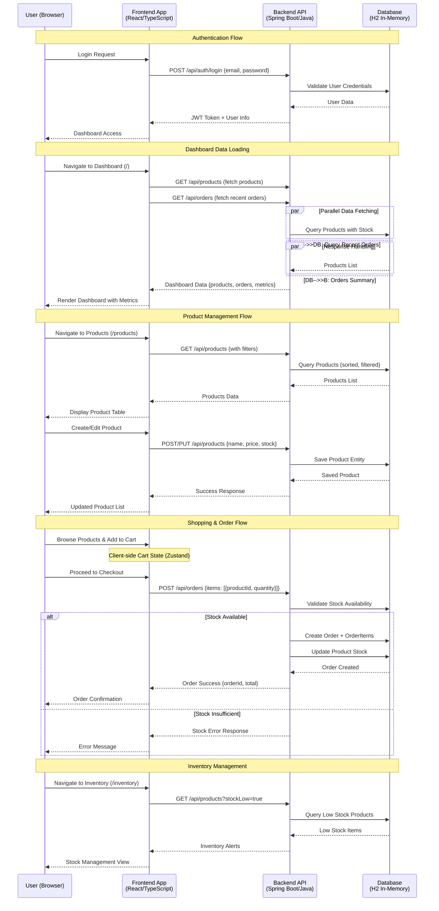

# OrderFlow - Order Management System

> **Technical Task**: INFORM GmbH Senior Full-Stack Developer assessment  
> Build a complete order management system with REST API backend and React frontend  
> Focus: Clean architecture, API design, and modern development practices

## 🔄 System Flow Diagram



**Key Interactions:**
- **Route-based Loading**: TanStack Router loaders fetch data before page render
- **Server-side Calculations**: Order totals and stock validation handled in backend  
- **Real-time Updates**: Optimistic UI updates with background synchronization
- **JWT Authentication**: Stateless authentication for API security

Full-stack order management application built with React and Java.

- **Frontend**: Route-based data fetching with TanStack Router loaders
- **Backend**: Clean layered architecture with dependency inversion
- **Communication**: RESTful APIs with JWT authentication

## 🛠️ Technology Stack

### Frontend (React Stack)
- **React 19** with latest concurrent features
- **TypeScript 5.9** for comprehensive type safety
- **TanStack Router 1.139** for type-safe routing with loaders
- **TanStack Query 5.90** for server state management and caching
- **TanStack Table 8.21** for advanced data tables
- **Zustand 5.0** for client-side state management
- **Vite 7** for lightning-fast development and build
- **Tailwind CSS 4.1** with modern CSS features
- **Radix UI** for accessible component primitives
- **Lucide React** for beautiful icons

### Backend (Enterprise Java Stack)
- **Java 21** with modern language features (managed via SDKMAN)
- **Spring Boot 3.x** with enhanced performance and security
- **Spring Security 6** for JWT-based authentication
- **Spring Data JPA** for data persistence and transactions
- **H2** development data storage
- **OpenAPI 3** with Swagger UI for comprehensive API documentation
- **Maven** for robust dependency management and builds

## 🏗️ Application Architecture

```
┌─────────────────────────────────────────────────────────────────┐
│                          FRONTEND (React)                      │
├─────────────────────────────────────────────────────────────────┤
│  📱 Pages & Routes (TanStack Router)                           │
│  ├── Dashboard.tsx        → /                                  │
│  ├── Products.tsx         → /products                          │
│  ├── Orders.tsx           → /orders                            │
│  ├── Inventory.tsx        → /inventory                         │
│  └── Login.tsx            → /login                             │
│                                                                 │
│  🧩 Components & UI                                            │
│  ├── Layout (Header, Sidebar)                                  │
│  ├── Product Management (Modal, Details)                       │
│  ├── Order Management (Details Dialog)                         │
│  └── Cart Management (CartView)                                │
│                                                                 │
│  🎛️ State Management                                           │
│  ├── Zustand Stores (Cart, App, Toast)                         │
│  ├── TanStack Query (Server State)                             │
│  └── Custom Hooks (useProducts, useOrders, useCart)            │
│                                                                 │
│  🔌 Services                                                   │
│  └── API Service (Axios + JWT Auth)                            │
└─────────────────────────────────────────────────────────────────┘
                                    │
                                    │ REST API (JWT Auth)
                                    │ Port: 3000 ↔ 8080
                                    │
┌─────────────────────────────────────────────────────────────────┐
│                       BACKEND (Spring Boot)                    │
├─────────────────────────────────────────────────────────────────┤
│  🎯 Controllers (REST Endpoints)                               │
│  ├── AuthController       → /api/auth/*                        │
│  ├── ProductController    → /api/products/*                    │
│  ├── OrderController      → /api/orders/*                      │
│  └── PingController       → /api/ping                          │
│                                                                 │
│  ⚙️ Services (Business Logic)                                  │
│  ├── UserService         → Authentication & User Management     │
│  ├── ProductService      → Product CRUD & Stock Management     │
│  └── OrderService        → Order Processing & Cart Calculation │
│                                                                 │
│  🗃️ Data Layer                                                 │
│  ├── JPA Repositories (Product, Order, User, Role)             │
│  ├── JPA Entities (Product, Order, OrderItem, User, Role)      │
│  └── DTOs (Requests/Responses)                                 │
│                                                                 │
│  🔐 Security Layer                                             │
│  ├── JWT Authentication Filter                                 │
│  ├── Security Configuration                                    │
│  └── JWT Utilities                                             │
└─────────────────────────────────────────────────────────────────┘
                                    │
                                    │ JPA/Hibernate
                                    │
┌─────────────────────────────────────────────────────────────────┐
│                    DATABASE (H2 In-Memory)                     │
├─────────────────────────────────────────────────────────────────┤
│  📊 Tables                                                     │
│  ├── users           → User accounts & authentication          │
│  ├── roles           → User roles (USER, ADMIN)                │
│  ├── products        → Product catalog & stock                 │
│  ├── orders          → Order headers                           │
│  └── order_items     → Order line items                        │
└─────────────────────────────────────────────────────────────────┘
```

### Key Architecture Patterns

**Frontend (React Ecosystem)**
- **Routing**: TanStack Router with type-safe route definitions and data loaders
- **State Management**: Zustand for client state, TanStack Query for server state  
- **Data Fetching**: Route-based loading with automatic caching and background sync
- **UI Components**: Radix UI primitives with Tailwind CSS styling

**Backend (Spring Boot)**
- **Architecture**: Clean layered architecture (Controller → Service → Repository)
- **Security**: JWT-based stateless authentication with role-based access
- **Data Access**: Spring Data JPA with automatic query generation
- **API Design**: RESTful endpoints with OpenAPI documentation

**Communication**
- **Protocol**: HTTP/HTTPS with JSON payload
- **Authentication**: JWT tokens with automatic refresh mechanism
- **CORS**: Configured for local development (localhost:3000 ↔ localhost:8080)

## 📋 Features

### 🛒 Product Management
- ✅ **Full CRUD Operations**: Create, read, update, delete products with validation
- ✅ **Advanced Product Tables**: Sortable, filterable data tables with pagination
- ✅ **Stock Management**: Stock tracking with dashboard alerts
- ✅ **Product Attributes**: UUID-based IDs, names, prices, stock quantities

### 📦 Order Management  
- ✅ **Shopping Cart**: Add/remove products with quantity management
- ✅ **Order Creation**: Multi-product orders with automatic calculations
- ✅ **Order Tracking**: Comprehensive order listing with detailed views
- ✅ **Stock Validation**: Real-time stock checks during order processing
- ✅ **Order History**: Customer order tracking and management

### 👥 User Management & Authentication
- ✅ **JWT Authentication**: Secure token-based authentication system
- ✅ **Role-Based Access**: User roles and permissions management
- ✅ **User Profiles**: Simple registry of users with some customers to test the solution, not for a production

### 📊 Dashboard & Analytics
- ✅ **Real-time Metrics**: Total orders, revenue, and product counts
- ✅ **Low Stock Alerts**: Automatic inventory monitoring
- ✅ **Recent Activity**: Latest orders and trending products
- ✅ **Business Intelligence**: Sales analytics and performance metrics

**State Management Strategy:**
- **TanStack Query**: Server state, caching, background updates, and synchronization
- **Route Loaders**: Data fetching happens on navigation, not component mount
- **Zustand Store**: Client-side application state (auth, UI preferences)
- **React State**: Local component state for forms and interactions

**Benefits:**
- ✅ **Automatic refetching** when navigating between routes
- ✅ **Optimistic updates** and background synchronization  
- ✅ **Intelligent caching** with automatic invalidation
- ✅ **Type-safe data loading** with full TypeScript support

## 🔧 Development Commands

### Backend
- `./mvnw clean` - Clean build artifacts
- `./mvnw compile` - Compile source code
- `./mvnw test` - Run unit tests
- `./mvnw spring-boot:run` - Start development server

### Frontend
- `npm run dev` - Start development server
- `npm run build` - Create production build
- `npm run preview` - Preview production build
- `npm run lint` - Run ESLint
- `npm run type-check` - Run TypeScript checks

## 🎯 Key Design Decisions

### Frontend Architecture Decisions
1. **TanStack Router over React Router**: Type-safe routing with built-in data loading capabilities
2. **Route-based Data Fetching**: Data fetching happens in route loaders, not component effects
3. **TanStack Query for Server State**: Intelligent caching, background sync, and optimistic updates
4. **Zustand for Client State**: Lightweight state management for authentication and UI preferences
5. **React 19 with Concurrent Features**: Latest React capabilities for better performance
6. **TypeScript Strict Mode**: Comprehensive type safety across the entire frontend

### Backend Architecture Decisions  
7. **Hexagonal Architecture**: Clean separation of concerns and testability in the Java backend
8. **JWT Authentication**: Stateless authentication with automatic token refresh
9. **PostgreSQL over H2**: Production-ready database for robust data storage
10. **Java 21**: Modern Java features including pattern matching and virtual threads
11. **Server-Side Calculations**: Total prices and business logic calculated securely on backend
12. **UUID Identifiers**: Enhanced security and distribution capabilities

### Performance & UX Decisions
13. **Route-based Code Splitting**: Automatic code splitting at the route level
14. **Optimistic UI Updates**: Immediate feedback with background synchronization
15. **Aggressive Caching Strategy**: Smart caching with automatic invalidation
16. **Mobile-First Design**: Responsive design prioritizing mobile experience

## 🤖 Notes on AI Usage

### Documentation of AI Agent Usage

This project was developed with support from **Claude CLI**, Anthropic's AI-powered coding assistant. The AI agent was used strategically across different phases of development:

#### Areas Where Claude CLI Provided Support:

1. **Project Structure & Setup**
   - Generated initial project scaffolding for both frontend (React/Vite) and backend (Spring Boot)
   - Configured build tools and dependency management (Maven, npm)
   - Set up TypeScript configurations and ESLint rules

2. **Backend Development**
   - Generated boilerplate code for REST controllers and service classes
   - Implemented hexagonal architecture patterns with clean layer separation
   - Created JPA entities and repository interfaces following domain-driven design
   - Generated OpenAPI/Swagger documentation configuration

3. **Frontend Development**
   - Created React component structure and TypeScript interfaces
   - Configure Zustand stores for state management
   - Generated API service layer with Axios integration
   - Built responsive UI components with Tailwind CSS

4. **Testing & Quality Assurance**
   - Generated unit test templates and sample test data
   - Created API integration tests and validation scenarios
   - Implemented error handling patterns across the application

### Quality Assessment & Reliability

**Strengths of AI Assistance:**
- ✅ Excellent for generating consistent, well-structured boilerplate code
- ✅ Reliable for implementing established patterns (REST APIs, React components)
- ✅ Strong support for configuration files and build tool setup
- ✅ Effective at maintaining coding standards and consistent naming conventions
- ✅ Helpful for generating comprehensive documentation and API specifications

**Limitations and Weaknesses:**
- ️⚠️ Context is limited, in most cases, each decision to be taken, must always be evaluated and follow it as a task completition, each task must finish the context and start a new one to avoid allusinations.
- ⚠️ Outdated in some scenarios where new technologies, specially in latest frontend trends and new libraries, had some changes in syntax between versions, the agent needed to be instructed several times to validate implementations of tanstack several times.
- ⚠️ Requires always validation and in domain requirements and conditions.
- ⚠️ All architectural decisions need to be plan in advance based on the selected technology.
- ⚠️ Generates in some scenarios overly complex solutions that required simplification.
- ⚠️ Required validation of best practices for security and performance considerations.

### Manual Adjustments and Corrections

**Critical Human Interventions:**
1. **Architecture Decisions**: Final choice of hexagonal architecture in backend in JAVA, its known and easy to read by others. and react simple feature based pattern (SCREAM architecture principals) (views/features)
2. **Business Logic**: Order calculation logic, stock validation, and data integrity rules were manually implemented and validated
3. **Error Handling**: Custom exception handling and validation logic were refined beyond AI suggestions
4. **Security Considerations**: Manual review and implementation of input validation and data sanitization
5. **Performance Optimizations**: Database query optimization and frontend state management improvements
6. **Code Refactoring**: Several refactors were made during the implementation of the REACT solution.

**Time Investment**: ~6-8 hours development time, between Thursday 20, Friday 21, Monday 24, Tuesday 25, documentation was handle mostly during wednesday 26