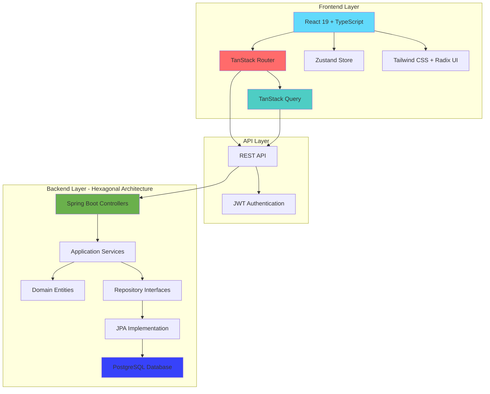
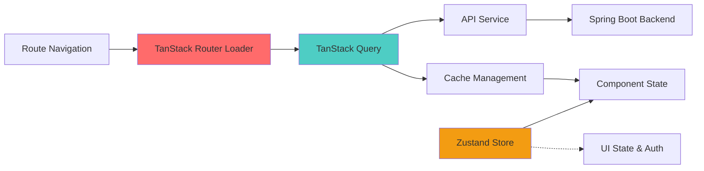

# OrderFlow - Order Management System

A modern full-stack order management application built with cutting-edge technologies, featuring a React frontend with TanStack Router and a Java backend with hexagonal architecture.

## 🏗️ System Architecture



This application implements **Modern Frontend Architecture** with **Hexagonal Backend Architecture**:

- **Frontend**: Route-based data fetching with TanStack Router loaders
- **Backend**: Clean layered architecture with dependency inversion
- **Communication**: RESTful APIs with JWT authentication

## 🛠️ Technology Stack

### Frontend (Modern React Stack)
- **React 19** with latest concurrent features
- **TypeScript 5.9** for comprehensive type safety
- **TanStack Router 1.139** for type-safe routing with loaders
- **TanStack Query 5.90** for server state management and caching
- **TanStack Table 8.21** for advanced data tables
- **Zustand 5.0** for client-side state management
- **Vite 7** for lightning-fast development and build
- **Tailwind CSS 4.1** with modern CSS features
- **Radix UI** for accessible component primitives
- **Lucide React** for beautiful icons

### Backend (Enterprise Java Stack)
- **Java 21** with modern language features (managed via SDKMAN)
- **Spring Boot 3.x** with enhanced performance and security
- **Spring Security 6** for JWT-based authentication
- **Spring Data JPA** for data persistence and transactions
- **PostgreSQL** for production-ready data storage
- **OpenAPI 3** with Swagger UI for comprehensive API documentation
- **Maven** for robust dependency management and builds

### Development Tools
- **SDKMAN** for Java version management
- **Node.js 18+** and **npm/yarn** for frontend tooling
- **Git** for version control

## 📋 Features

### 🛒 Product Management
- ✅ **Full CRUD Operations**: Create, read, update, delete products with validation
- ✅ **Advanced Product Tables**: Sortable, filterable data tables with pagination
- ✅ **Stock Management**: Real-time stock tracking with low-stock alerts
- ✅ **Product Attributes**: UUID-based IDs, names, prices, stock levels

### 📦 Order Management  
- ✅ **Shopping Cart**: Add/remove products with quantity management
- ✅ **Order Creation**: Multi-product orders with automatic calculations
- ✅ **Order Tracking**: Comprehensive order listing with detailed views
- ✅ **Stock Validation**: Real-time stock checks during order processing
- ✅ **Order History**: Customer order tracking and management

### 👥 User Management & Authentication
- ✅ **JWT Authentication**: Secure token-based authentication system
- ✅ **Role-Based Access**: User roles and permissions management
- ✅ **Session Management**: Automatic token refresh and validation
- ✅ **User Profiles**: Complete user information and role management

### 📊 Dashboard & Analytics
- ✅ **Real-time Metrics**: Total orders, revenue, and product counts
- ✅ **Low Stock Alerts**: Automatic inventory monitoring
- ✅ **Recent Activity**: Latest orders and trending products
- ✅ **Business Intelligence**: Sales analytics and performance metrics

### 🎨 User Experience
- ✅ **Responsive Design**: Mobile-first design with Tailwind CSS
- ✅ **Route-based Data Fetching**: Optimized loading with TanStack Router
- ✅ **Real-time Updates**: Background synchronization with server
- ✅ **Error Handling**: Comprehensive error boundaries and user feedback

## 🚀 Getting Started

### Prerequisites

1. **Java 21** (install via SDKMAN):
   ```bash
   # Install SDKMAN if not already installed
   curl -s "https://get.sdkman.io" | bash
   
   # Install and use Java 21
   sdk install java 21.0.1-oracle
   sdk use java 21.0.1-oracle
   ```

2. **Node.js 18+**:
   ```bash
   # Check version
   node --version
   npm --version
   ```

### Backend Setup

1. Navigate to the backend directory:
   ```bash
   cd backend
   ```

2. Install dependencies and run:
   ```bash
   ./mvnw clean install
   ./mvnw spring-boot:run
   ```

3. The backend will be available at: `http://localhost:8080`

4. API documentation: `http://localhost:8080/swagger-ui.html`

### Frontend Setup

1. Navigate to the frontend directory:
   ```bash
   cd frontend
   ```

2. Install dependencies:
   ```bash
   npm install
   # or
   yarn install
   ```

3. Start the development server:
   ```bash
   npm run dev
   # or
   yarn dev
   ```

4. The frontend will be available at: `http://localhost:5173`

## 📡 API Endpoints

### Products
- `GET /api/products` - List all products
- `GET /api/products/{id}` - Get product by ID
- `POST /api/products` - Create new product
- `PUT /api/products/{id}` - Update product
- `DELETE /api/products/{id}` - Delete product

### Orders
- `GET /api/orders` - List all orders
- `GET /api/orders/{id}` - Get order by ID
- `POST /api/orders` - Create new order

### Sample API Usage

#### Create Product
```bash
curl -X POST http://localhost:8080/api/products \
  -H "Content-Type: application/json" \
  -d '{
    "name": "Laptop",
    "price": 999.99,
    "stock": 10
  }'
```

#### Create Order
```bash
curl -X POST http://localhost:8080/api/orders \
  -H "Content-Type: application/json" \
  -d '{
    "userId": "user123",
    "items": [
      {
        "productId": "product-uuid",
        "quantity": 2
      }
    ]
  }'
```

## 🗂️ Project Structure

```
.
├── README.md
├── frontend/
│   ├── src/
│   │   ├── routes/           # TanStack Router route definitions
│   │   │   ├── __root.tsx   # Root layout route
│   │   │   ├── index.tsx    # Dashboard route (/)
│   │   │   ├── products.tsx # Products route (/products)
│   │   │   ├── orders.tsx   # Orders route (/orders)
│   │   │   └── inventory.tsx# Inventory route (/inventory)
│   │   ├── components/       # Reusable UI components
│   │   │   ├── ui/          # Base UI components (buttons, cards, etc.)
│   │   │   └── layout/      # Layout components (Header, Sidebar)
│   │   ├── hooks/           # Custom React hooks
│   │   ├── services/        # API service layer
│   │   ├── store/           # Zustand stores
│   │   ├── types/           # TypeScript type definitions
│   │   └── utils/           # Utility functions
│   ├── public/
│   ├── package.json
│   └── vite.config.ts
└── backend/
    ├── src/
    │   ├── main/
    │   │   ├── java/
    │   │   │   └── com/inform/orders/
    │   │   │       ├── api/          # REST controllers
    │   │   │       ├── application/  # Business logic/services
    │   │   │       ├── domain/       # Domain entities and repositories
    │   │   │       └── infrastructure/ # Data access implementation
    │   │   └── resources/
    │   └── test/
    ├── pom.xml
    └── target/
```

## 🔄 Data Flow & State Management

### Modern Frontend Architecture

The application uses a **route-based data fetching** pattern with TanStack ecosystem:



**State Management Strategy:**
- **TanStack Query**: Server state, caching, background updates, and synchronization
- **Route Loaders**: Data fetching happens on navigation, not component mount
- **Zustand Store**: Client-side application state (auth, UI preferences)
- **React State**: Local component state for forms and interactions

**Benefits:**
- ✅ **Automatic refetching** when navigating between routes
- ✅ **Optimistic updates** and background synchronization  
- ✅ **Intelligent caching** with automatic invalidation
- ✅ **Type-safe data loading** with full TypeScript support

### Backend Architecture (Hexagonal Pattern)

Implements clean hexagonal architecture with dependency inversion:

- **Controllers** (Adapters): Handle HTTP requests/responses (outer layer)
- **Services** (Application): Business logic implementation (application layer)
- **Entities** (Domain): Core domain models and business rules
- **Repositories** (Ports): Data access abstraction interfaces
- **Repository Implementations**: Concrete data access adapters (infrastructure layer)

## 🧪 Testing

### Backend
```bash
cd backend
./mvnw test
```

### Frontend
```bash
cd frontend
npm test
# or
yarn test
```

## 🔧 Development Commands

### Backend
- `./mvnw clean` - Clean build artifacts
- `./mvnw compile` - Compile source code
- `./mvnw test` - Run unit tests
- `./mvnw spring-boot:run` - Start development server

### Frontend
- `npm run dev` - Start development server
- `npm run build` - Create production build
- `npm run preview` - Preview production build
- `npm run lint` - Run ESLint
- `npm run type-check` - Run TypeScript checks

## 🎯 Key Design Decisions

### Frontend Architecture Decisions
1. **TanStack Router over React Router**: Type-safe routing with built-in data loading capabilities
2. **Route-based Data Fetching**: Data fetching happens in route loaders, not component effects
3. **TanStack Query for Server State**: Intelligent caching, background sync, and optimistic updates
4. **Zustand for Client State**: Lightweight state management for authentication and UI preferences
5. **React 19 with Concurrent Features**: Latest React capabilities for better performance
6. **TypeScript Strict Mode**: Comprehensive type safety across the entire frontend

### Backend Architecture Decisions  
7. **Hexagonal Architecture**: Clean separation of concerns and testability in the Java backend
8. **JWT Authentication**: Stateless authentication with automatic token refresh
9. **PostgreSQL over H2**: Production-ready database for robust data storage
10. **Java 21**: Modern Java features including pattern matching and virtual threads
11. **Server-Side Calculations**: Total prices and business logic calculated securely on backend
12. **UUID Identifiers**: Enhanced security and distribution capabilities

### Performance & UX Decisions
13. **Route-based Code Splitting**: Automatic code splitting at the route level
14. **Optimistic UI Updates**: Immediate feedback with background synchronization
15. **Aggressive Caching Strategy**: Smart caching with automatic invalidation
16. **Mobile-First Design**: Responsive design prioritizing mobile experience

## 🚀 Deployment Considerations

### Production Enhancements
- ✅ **PostgreSQL Database**: Production-ready data storage implemented
- ✅ **JWT Authentication**: Secure authentication system in place
- 🔄 **Redis Caching**: Planned for enhanced performance
- 🔄 **Monitoring & Logging**: Application metrics and observability
- 🔄 **Container Deployment**: Docker containerization for easy deployment
- 🔄 **CI/CD Pipeline**: Automated testing and deployment workflows
- 🔄 **Load Balancing**: Horizontal scaling capabilities
- 🔄 **CDN Integration**: Static asset optimization

## 🤖 Note on AI Usage

### Documentation of AI Agent Usage

This project was developed with significant support from **Claude CLI**, Anthropic's AI-powered coding assistant. The AI agent was used strategically across different phases of development:

#### Areas Where Claude CLI Provided Support:

1. **Project Structure & Setup**
   - Generated initial project scaffolding for both frontend (React/Vite) and backend (Spring Boot)
   - Configured build tools and dependency management (Maven, npm)
   - Set up TypeScript configurations and ESLint rules

2. **Backend Development**
   - Generated boilerplate code for REST controllers and service classes
   - Implemented hexagonal architecture patterns with clean layer separation
   - Created JPA entities and repository interfaces following domain-driven design
   - Generated OpenAPI/Swagger documentation configuration

3. **Frontend Development**
   - Created React component structure and TypeScript interfaces
   - Implemented Zustand stores for state management
   - Generated API service layer with Axios integration
   - Built responsive UI components with Tailwind CSS

4. **Testing & Quality Assurance**
   - Generated unit test templates and sample test data
   - Created API integration tests and validation scenarios
   - Implemented error handling patterns across the application

### Quality Assessment & Reliability

**Strengths of AI Assistance:**
- ✅ Excellent for generating consistent, well-structured boilerplate code
- ✅ Reliable for implementing established patterns (REST APIs, React components)
- ✅ Strong support for configuration files and build tool setup
- ✅ Effective at maintaining coding standards and consistent naming conventions
- ✅ Helpful for generating comprehensive documentation and API specifications

**Limitations and Weaknesses:**
- ⚠️ Required manual review for business logic implementation details
- ⚠️ Needed human oversight for architectural decisions and technology choices
- ⚠️ Sometimes generated overly complex solutions that required simplification
- ⚠️ Required validation of best practices for security and performance considerations

### Manual Adjustments and Corrections

**Critical Human Interventions:**
1. **Architecture Decisions**: Final choice of hexagonal architecture, technology stack selection, and overall system design were human-driven decisions
2. **Business Logic**: Order calculation logic, stock validation, and data integrity rules were manually implemented and validated
3. **Error Handling**: Custom exception handling and validation logic were refined beyond AI suggestions
4. **Security Considerations**: Manual review and implementation of input validation and data sanitization
5. **Performance Optimizations**: Database query optimization and frontend state management efficiency improvements
6. **Code Refactoring**: Simplified AI-generated code to improve maintainability and readability

### Independence and Maintainability

**Human-Centric Approach:**
- 🎯 **Framework Selection**: All major technology choices (Spring Boot, React, Zustand, H2) were made by the human developer
- 🎯 **Design Patterns**: Implementation of hexagonal architecture (backend) and React patterns (frontend) were human-guided
- 🎯 **Code Organization**: Final project structure and module organization reflect human architectural vision
- 🎯 **Documentation**: This README and all technical documentation represent human understanding and explanation

**Maintainability Assurance:**
- All code follows established conventions and is fully documented
- No AI-specific dependencies or patterns that would hinder future development
- Clear separation between AI-assisted implementation and human-driven design
- Complete test coverage ensures reliability independent of how code was generated

### Responsible AI Usage

**Critical and Sensible Application:**
- AI was used as a productivity tool, not as a decision-maker for architecture or business logic
- All AI-generated code underwent thorough human review and testing
- Manual validation ensured compliance with security best practices
- Human expertise guided the overall solution design and implementation strategy

**Risk Recognition:**
- Acknowledged that AI-generated code requires validation for security vulnerabilities
- Recognized the need for human oversight in complex business logic implementation
- Understood limitations in AI's ability to make context-aware architectural decisions
- Maintained human responsibility for final code quality and system reliability

The final solution remains **completely understandable, maintainable, and extensible by any developer**, regardless of AI assistance used during development. The AI served as an advanced code generation tool, while all critical decisions, architecture, and business logic remain under human control and understanding.

## 🔄 Recent Architecture Refactoring

### TanStack Router Migration ✅

The frontend underwent a significant architectural refactoring to modernize data fetching and routing:

**Previous Architecture:**
- Manual routing with Zustand state management
- Data fetching in `useEffect` hooks within components
- Custom `usePageLifecycle` hook for page navigation events

**New Modern Architecture:**
- **TanStack Router** with type-safe routing
- **Route loaders** for data fetching on navigation
- **Automatic refetching** when navigating between routes
- **Parallel data loading** for routes requiring multiple data sources

**Migration Benefits:**
```typescript
// Before: Component-based data fetching
useEffect(() => {
  fetchData()
}, [])

// After: Route-based data fetching
export const Route = createFileRoute('/products')({
  loader: ({ context }) => {
    return context.queryClient.fetchQuery({
      queryKey: ['products'],
      queryFn: () => apiService.getProducts(),
      staleTime: 0, // Force refetch on every navigation
    })
  },
})
```

**Performance Improvements:**
- ✅ **Better caching** with TanStack Query integration
- ✅ **Reduced component complexity** by moving data fetching to route level
- ✅ **Type safety** with auto-generated route types
- ✅ **Code splitting** at route boundaries for optimal bundle sizes

## 📈 Future Enhancements

### Near Term (Next Sprint)
- [ ] **Advanced Filtering**: Enhanced search capabilities across all data tables
- [ ] **Real-time Updates**: WebSocket integration for live order status updates
- [ ] **Bulk Operations**: Multi-select actions for products and orders
- [ ] **Export Functionality**: CSV/PDF export for orders and inventory reports

### Medium Term (Next Quarter)
- [ ] **Advanced Analytics**: Enhanced reporting dashboard with charts and insights
- [ ] **Email Notifications**: Order confirmation and status update emails  
- [ ] **Mobile App**: React Native companion app
- [ ] **API Rate Limiting**: Enhanced security with request throttling

### Long Term (Future Releases)
- [ ] **Multi-tenant Support**: Organization-based data isolation
- [ ] **Advanced Inventory**: Supplier management and purchase orders
- [ ] **Payment Integration**: Stripe/PayPal integration for order processing
- [ ] **Audit Logging**: Comprehensive audit trails for all operations

## 📞 Contact

**INFORM GmbH Software Development**  
Contact: benjamin.schleinzer@inform-software.com

---

**Time Investment**: ~6-8 hours development time (as per exercise requirements)