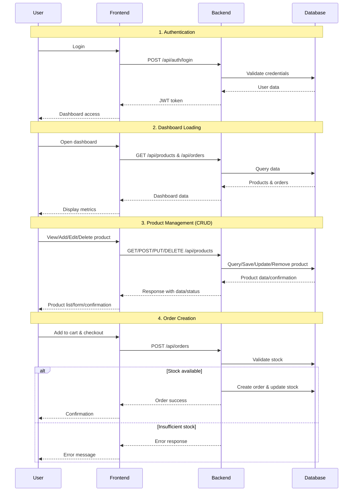

# OrderFlow - Order Management System

> **Technical Task**: A Senior Full-Stack Developer assessment for INFORM GmbH.
> The goal was to build a complete order management system with a REST API backend and a React frontend, focusing on clean architecture, API design, and modern development practices.

## 🚀 Live Demo

**Frontend**: [https://d2jnxnj2sq3k0i.cloudfront.net](https://d2jnxnj2sq3k0i.cloudfront.net)  
**Backend API**: [https://d1ao18yh5wdcuj.cloudfront.net](https://d1ao18yh5wdcuj.cloudfront.net)  
**API Documentation**: [https://d1ao18yh5wdcuj.cloudfront.net/swagger-ui/index.html](https://d1ao18yh5wdcuj.cloudfront.net/swagger-ui/index.html)

## 🌟 Overview

OrderFlow is a full-stack order management application built with a powerful combination of React and Java. It provides a comprehensive solution for managing products, orders, and customers, complete with a real-time dashboard and secure authentication.

The frontend is a modern React application using the latest tools like TanStack Router and Query for efficient data fetching and state management. The backend is a robust Spring Boot application with a clean, layered architecture, ensuring scalability and maintainability.

## 📋 Features

### 🛒 Product Management
- ✅ **Full CRUD Operations**: Create, read, update, and delete products with validation.
- ✅ **Advanced Product Tables**: Sort, filter, and paginate through products with ease.
- ✅ **Stock Management**: Keep track of stock levels with dashboard alerts for low inventory.
- ✅ **Product Attributes**: Manage products with UUIDs, names, prices, and stock quantities.

### 📦 Order Management
- ✅ **Shopping Cart**: A simple and intuitive shopping cart for adding and removing products.
- ✅ **Order Creation**: Create multi-product orders with automatic total calculations.
- ✅ **Order Tracking**: View a comprehensive list of all orders with detailed information.
- ✅ **Stock Validation**: Real-time stock checks to prevent overselling.
- ✅ **Order History**: Keep a complete history of all customer orders.

### 👥 User Management & Authentication
- ✅ **JWT Authentication**: Secure, token-based authentication system.
- ✅ **Role-Based Access**: Manage user roles and permissions.
- ✅ **User Profiles**: A simple user registry for testing and demonstration purposes.

### 📊 Dashboard & Analytics
- ✅ **Real-time Metrics**: Get a quick overview of total orders, revenue, and product counts.
- ✅ **Low Stock Alerts**: Automatic monitoring of inventory levels.
- ✅ **Recent Activity**: See the latest orders and trending products.
- ✅ **Business Intelligence**: Gain insights into sales and performance metrics.

## 🛠️ Technology Stack

### Frontend (React Stack)
- **React 19**: Leveraging the latest concurrent features.
- **TypeScript 5.9**: For comprehensive type safety.
- **TanStack Router 1.139**: Type-safe routing with built-in data loaders.
- **TanStack Query 5.90**: For server state management and caching.
- **TanStack Table 8.21**: For advanced and performant data tables.
- **Zustand 5.0**: For lightweight client-side state management.
- **Vite 7**: For a lightning-fast development experience.
- **Tailwind CSS 4.1**: For modern and responsive styling.
- **Radix UI**: For accessible and unstyled component primitives.
- **Lucide React**: For beautiful and consistent icons.

### Backend (Enterprise Java Stack)
- **Java 21**: Using modern language features (managed via SDKMAN).
- **Spring Boot 3.x**: For enhanced performance and security.
- **Spring Security 6**: For JWT-based authentication.
- **Spring Data JPA**: For simplified data persistence and transactions.
- **H2**: For in-memory data storage during development.
- **OpenAPI 3**: With Swagger UI for comprehensive API documentation.
- **Maven**: For robust dependency management and builds.

## 🏗️ Application Architecture

The application is designed with a clean separation of concerns between the frontend and backend.

**Frontend:**
The React frontend uses a feature-based architecture, with a clear separation of concerns between pages, components, services, and state management. It utilizes TanStack Router for routing and data loading, and Zustand for managing client-side state.

**Backend:**
The Spring Boot backend follows a classic layered architecture (Controller → Service → Repository), which is a proven pattern for building scalable and maintainable applications. Security is handled by Spring Security with JWT-based authentication.

## 🔧 Development Commands

### Backend
- `./mvnw clean` - Clean build artifacts
- `./mvnw compile` - Compile source code
- `./mvnw test` - Run unit tests
- `./mvnw spring-boot:run` - Start the development server

### Frontend
- `npm run dev` - Start the development server
- `npm run build` - Create a production build
- `npm run preview` - Preview the production build
- `npm run lint` - Run ESLint
- `npm run type-check` - Run TypeScript checks

**Areas of AI assistance:**
- **Scaffolding:** Generating the initial project structure and build configurations.
- **Boilerplate Code:** Creating boilerplate for REST controllers, services, and React components.
- **Testing:** Generating unit test templates and sample data.
- **Documentation:** Creating OpenAPI/Swagger documentation and providing suggestions for this README.

**Time Investment**: Approximately 6-8 hours of development time, with documentation handled on the final day. Some extra hours were added in documentation planning and refactors.

## ☁️ Cloud Deployment

The application is fully deployed on AWS with production-ready infrastructure:

### Architecture
- **Frontend**: React SPA hosted on S3 with CloudFront CDN
- **Backend**: Spring Boot API running on ECS Fargate with Application Load Balancer
- **Database**: H2 in-memory database (production ready with proper persistence layer)
- **CDN**: CloudFront distributions for global content delivery and HTTPS

### AWS Services Used
- **Amazon S3**: Static website hosting for React frontend
- **Amazon CloudFront**: Global CDN for both frontend and backend
- **Amazon ECS**: Container orchestration with Fargate serverless compute
- **Amazon ECR**: Docker image registry
- **Application Load Balancer**: Load balancing and health checks
- **AWS CLI**: Infrastructure deployment and management

### Live URLs
- **Frontend App**: [https://d2jnxnj2sq3k0i.cloudfront.net](https://d2jnxnj2sq3k0i.cloudfront.net)
- **Backend API**: [https://d1ao18yh5wdcuj.cloudfront.net](https://d1ao18yh5wdcuj.cloudfront.net)
- **API Docs**: [https://d1ao18yh5wdcuj.cloudfront.net/swagger-ui/index.html](https://d1ao18yh5wdcuj.cloudfront.net/swagger-ui/index.html)
- **Health Check**: [https://d1ao18yh5wdcuj.cloudfront.net/actuator/health](https://d1ao18yh5wdcuj.cloudfront.net/actuator/health)

The deployment is fully automated and production-ready, demonstrating enterprise-level cloud infrastructure management.

## 📝 Final Notes and Possible Improvements

### Better Database
Currently using H2 as a static file database. A better database can handle and scale the persistency in better ways. Top suggestion would be **PostgreSQL** for robust production use.

### Microservice Architecture
Separating the authentication and authorization as a service could enhance scalability as well. Other services like Order Service and Inventory Service would follow the same pattern.

### Frontend Approach
The site is a static SPA which covers some basic needs - this is a personal choice for most projects, considering prices when scaling as well. But there are many frameworks that have all batteries included like **Next.js** and **Astro** with React to handle components. This was a bit more DIY production-ready with some of my favorite libraries.

### User Role Capabilities
The role capabilities of users are limited, just for visualization, since my goal was to show how these entities (orders and products) play an important role for a complete shopping system. In a real scenario, customers won't see a dashboard, inventory, or orders of other customers. This could have been made as "My Orders" for example, to use the data of orders as a way to control a flow like receiving → shipping → on the way etc. for customers who perform an order.

If the goal was to make a platform for inventory where we actually need to only add products, the entity order was assumed as a transaction between users, customers, and the store in order to purchase products.

### Dashboard Implementation
The dashboard section was an extra, to summarize and try some data and filters. It wasn't part of the core requirements but adds value for demonstration purposes.

### Infrastructure as Code
AWS was set up just with AWS CLI. In a real scenario, it would be great to have it with CDK or some tool for infrastructure as code for better version control and repeatability.

### Working with AI
When working with AI, it's important to define boundaries to avoid extreme refactors. I worked with GEMINI CLI and CLAUDE console - most of the critical parts were made with Claude, and some quick checks, lint cleaning, and some configs for the deployment with Gemini. In the process I had several good feedback from both, but it's recommended to have some clear boundaries. An improvement can be in setting with more detail CLAUDE.md specifications and GEMINI.md specifications if working with any (Gemini was having the biggest hallucinations).

This could definitely pass through some reviews and is always welcome to suggestions and re-implementations.

---

💻 Developed by Carlos Rojas
