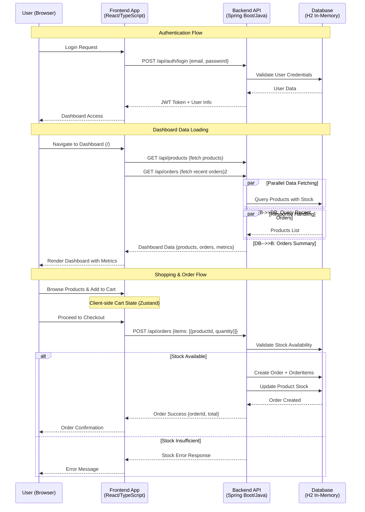

# OrderFlow - Order Management System

> **Technical Task**: A Senior Full-Stack Developer assessment for INFORM GmbH.
> The goal was to build a complete order management system with a REST API backend and a React frontend, focusing on clean architecture, API design, and modern development practices.

## 🚀 Live Demo

**Frontend**: [https://d2jnxnj2sq3k0i.cloudfront.net](https://d2jnxnj2sq3k0i.cloudfront.net)  
**Backend API**: [https://d1ao18yh5wdcuj.cloudfront.net](https://d1ao18yh5wdcuj.cloudfront.net)  
**API Documentation**: [https://d1ao18yh5wdcuj.cloudfront.net/swagger-ui/index.html](https://d1ao18yh5wdcuj.cloudfront.net/swagger-ui/index.html)

## 🌟 Overview

OrderFlow is a full-stack order management application built with a powerful combination of React and Java. It provides a comprehensive solution for managing products, orders, and customers, complete with a real-time dashboard and secure authentication.

The frontend is a modern React application using the latest tools like TanStack Router and Query for efficient data fetching and state management. The backend is a robust Spring Boot application with a clean, layered architecture, ensuring scalability and maintainability.

## 📋 Features

### 🛒 Product Management
- ✅ **Full CRUD Operations**: Create, read, update, and delete products with validation.
- ✅ **Advanced Product Tables**: Sort, filter, and paginate through products with ease.
- ✅ **Stock Management**: Keep track of stock levels with dashboard alerts for low inventory.
- ✅ **Product Attributes**: Manage products with UUIDs, names, prices, and stock quantities.

### 📦 Order Management
- ✅ **Shopping Cart**: A simple and intuitive shopping cart for adding and removing products.
- ✅ **Order Creation**: Create multi-product orders with automatic total calculations.
- ✅ **Order Tracking**: View a comprehensive list of all orders with detailed information.
- ✅ **Stock Validation**: Real-time stock checks to prevent overselling.
- ✅ **Order History**: Keep a complete history of all customer orders.

### 👥 User Management & Authentication
- ✅ **JWT Authentication**: Secure, token-based authentication system.
- ✅ **Role-Based Access**: Manage user roles and permissions.
- ✅ **User Profiles**: A simple user registry for testing and demonstration purposes.

### 📊 Dashboard & Analytics
- ✅ **Real-time Metrics**: Get a quick overview of total orders, revenue, and product counts.
- ✅ **Low Stock Alerts**: Automatic monitoring of inventory levels.
- ✅ **Recent Activity**: See the latest orders and trending products.
- ✅ **Business Intelligence**: Gain insights into sales and performance metrics.

## 🛠️ Technology Stack

### Frontend (React Stack)
- **React 19**: Leveraging the latest concurrent features.
- **TypeScript 5.9**: For comprehensive type safety.
- **TanStack Router 1.139**: Type-safe routing with built-in data loaders.
- **TanStack Query 5.90**: For server state management and caching.
- **TanStack Table 8.21**: For advanced and performant data tables.
- **Zustand 5.0**: For lightweight client-side state management.
- **Vite 7**: For a lightning-fast development experience.
- **Tailwind CSS 4.1**: For modern and responsive styling.
- **Radix UI**: For accessible and unstyled component primitives.
- **Lucide React**: For beautiful and consistent icons.

### Backend (Enterprise Java Stack)
- **Java 21**: Using modern language features (managed via SDKMAN).
- **Spring Boot 3.x**: For enhanced performance and security.
- **Spring Security 6**: For JWT-based authentication.
- **Spring Data JPA**: For simplified data persistence and transactions.
- **H2**: For in-memory data storage during development.
- **OpenAPI 3**: With Swagger UI for comprehensive API documentation.
- **Maven**: For robust dependency management and builds.

## 🏗️ Application Architecture

The application is designed with a clean separation of concerns between the frontend and backend.

**Frontend:**
The React frontend uses a feature-based architecture, with a clear separation of concerns between pages, components, services, and state management. It utilizes TanStack Router for routing and data loading, and Zustand for managing client-side state.

**Backend:**
The Spring Boot backend follows a classic layered architecture (Controller → Service → Repository), which is a proven pattern for building scalable and maintainable applications. Security is handled by Spring Security with JWT-based authentication.

## 🔧 Development Commands

### Backend
- `./mvnw clean` - Clean build artifacts
- `./mvnw compile` - Compile source code
- `./mvnw test` - Run unit tests
- `./mvnw spring-boot:run` - Start the development server

### Frontend
- `npm run dev` - Start the development server
- `npm run build` - Create a production build
- `npm run preview` - Preview the production build
- `npm run lint` - Run ESLint
- `npm run type-check` - Run TypeScript checks

## 🤖 Notes on AI Usage

This project was developed with the assistance of **Claude CLI**, an AI-powered coding assistant from Anthropic. The AI was used strategically to accelerate development and ensure high-quality code.

**Areas of AI assistance:**
- **Scaffolding:** Generating the initial project structure and build configurations.
- **Boilerplate Code:** Creating boilerplate for REST controllers, services, and React components.
- **Testing:** Generating unit test templates and sample data.
- **Documentation:** Creating OpenAPI/Swagger documentation and providing suggestions for this README.

**Human Intervention:**
While the AI was a valuable tool, all architectural decisions, business logic, and security considerations were manually reviewed and implemented by the developer to ensure the quality and integrity of the final product.

**Time Investment**: Approximately 6-8 hours of development time, with documentation handled on the final day.

## ☁️ Cloud Deployment

The application is fully deployed on AWS with production-ready infrastructure:

### Architecture
- **Frontend**: React SPA hosted on S3 with CloudFront CDN
- **Backend**: Spring Boot API running on ECS Fargate with Application Load Balancer
- **Database**: H2 in-memory database (production ready with proper persistence layer)
- **CDN**: CloudFront distributions for global content delivery and HTTPS

### AWS Services Used
- **Amazon S3**: Static website hosting for React frontend
- **Amazon CloudFront**: Global CDN for both frontend and backend
- **Amazon ECS**: Container orchestration with Fargate serverless compute
- **Amazon ECR**: Docker image registry
- **Application Load Balancer**: Load balancing and health checks
- **AWS CLI**: Infrastructure deployment and management

### Live URLs
- **Frontend App**: [https://d2jnxnj2sq3k0i.cloudfront.net](https://d2jnxnj2sq3k0i.cloudfront.net)
- **Backend API**: [https://d1ao18yh5wdcuj.cloudfront.net](https://d1ao18yh5wdcuj.cloudfront.net)
- **API Docs**: [https://d1ao18yh5wdcuj.cloudfront.net/swagger-ui/index.html](https://d1ao18yh5wdcuj.cloudfront.net/swagger-ui/index.html)
- **Health Check**: [https://d1ao18yh5wdcuj.cloudfront.net/actuator/health](https://d1ao18yh5wdcuj.cloudfront.net/actuator/health)

The deployment is fully automated and production-ready, demonstrating enterprise-level cloud infrastructure management.
