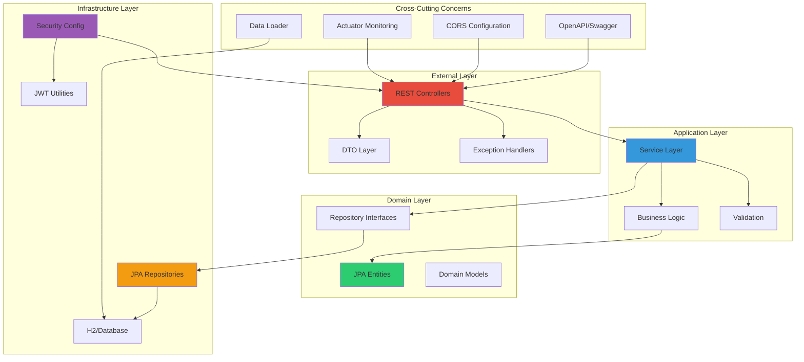
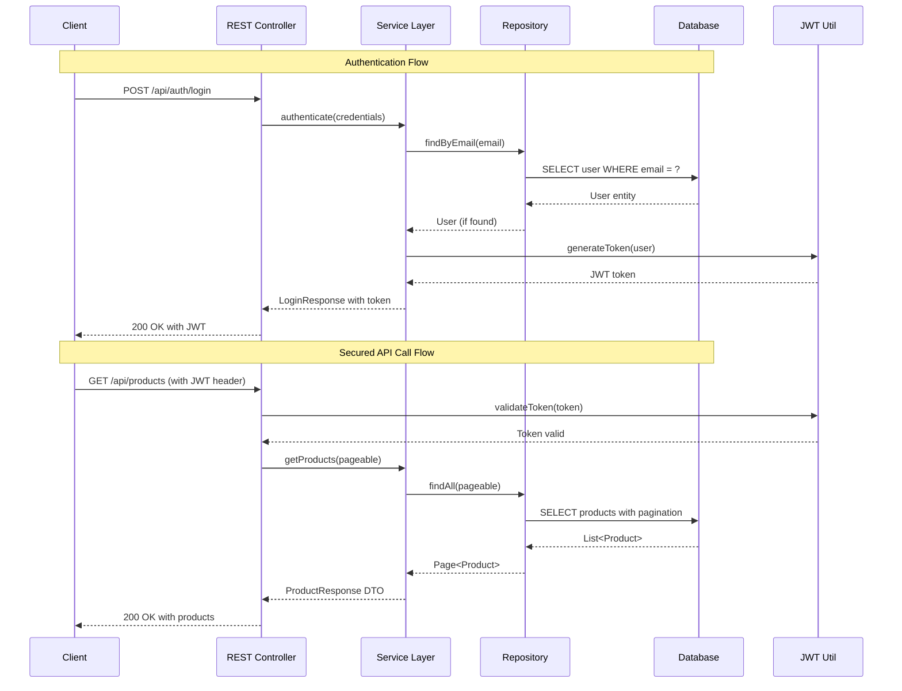
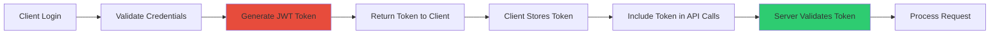

# OrderFlow - Backend API

A robust Spring Boot backend API for the OrderFlow order management system, implementing clean architecture principles with modern Java features.

## 🏗️ Backend Architecture



## 🛠️ Technology Stack

### Core Framework
- **Spring Boot 3.4.12** - Modern Spring framework with enhanced performance
- **Java 21** - Latest LTS with modern language features and performance improvements
- **Maven 3.9+** - Dependency management and build automation

### Spring Ecosystem
- **Spring Web** - RESTful API development with MVC pattern
- **Spring Data JPA** - Data persistence and repository abstraction
- **Spring Security 6** - Authentication, authorization, and security
- **Spring Validation** - Bean validation with JSR-303
- **Spring Actuator** - Production monitoring and management endpoints

### Database & Persistence
- **H2 Database** - In-memory database for development and testing
- **JPA/Hibernate** - Object-relational mapping and database operations
- **UUID Primary Keys** - Enhanced security and distribution capabilities

### Security
- **JWT (JSON Web Tokens)** - Stateless authentication and authorization
- **JJWT 0.12.3** - Robust JWT implementation with security features
- **BCrypt** - Password hashing and verification

### Documentation & Monitoring
- **OpenAPI 3** - API specification and documentation
- **Swagger UI** - Interactive API documentation and testing
- **Spring Actuator** - Health checks and application monitoring

### Development Tools
- **Lombok** - Boilerplate code reduction and cleaner syntax
- **Maven Surefire Plugin** - Enhanced test reporting and execution

## 📋 Features

### 🔐 Authentication & Security
- **JWT-based Authentication** - Stateless token-based security
- **Role-based Authorization** - User roles and permission management
- **Password Encryption** - BCrypt hashing for secure password storage
- **Token Refresh** - Automatic token renewal for seamless user experience
- **CORS Configuration** - Cross-origin resource sharing for frontend integration

### 📦 Product Management
- **Full CRUD Operations** - Create, read, update, delete products
- **UUID-based Identifiers** - Enhanced security and uniqueness
- **Data Validation** - Comprehensive input validation and error handling
- **Pagination Support** - Efficient data retrieval for large datasets
- **Sorting & Filtering** - Advanced query capabilities

### 🛒 Order Management
- **Order Creation** - Multi-product orders with automatic calculations
- **Stock Validation** - Real-time inventory checking during order processing
- **Order Tracking** - Complete order lifecycle management
- **Order History** - Customer order tracking and retrieval
- **Business Logic** - Server-side calculations for security and accuracy

### 👥 User Management
- **User Registration** - Account creation with validation
- **Profile Management** - User information and preference updates
- **Role Assignment** - Admin and customer role management
- **Session Management** - Secure session handling with JWT

### 📊 Monitoring & Documentation
- **Health Checks** - Application and dependency health monitoring
- **API Documentation** - Comprehensive OpenAPI specification
- **Interactive Testing** - Swagger UI for API exploration
- **Performance Metrics** - Application performance monitoring

## 🗂️ Project Structure

```
src/main/java/com/inform/orderms/
├── controller/              # REST API Controllers (External Layer)
│   ├── AuthController.java     # Authentication endpoints
│   ├── ProductController.java  # Product CRUD operations
│   ├── OrderController.java    # Order management
│   └── PingController.java     # Health check endpoint
├── service/                 # Business Logic Layer (Application Layer)
│   ├── UserService.java        # User management business logic
│   ├── ProductService.java     # Product business operations
│   └── OrderService.java       # Order processing logic
├── model/                   # JPA Entities (Domain Layer)
│   ├── User.java               # User entity with authentication
│   ├── Role.java               # User roles and permissions
│   ├── Product.java            # Product domain model
│   ├── Order.java              # Order aggregate root
│   └── OrderItem.java          # Order line items
├── repository/              # Data Access Layer (Domain/Infrastructure)
│   ├── UserRepository.java     # User data access
│   ├── RoleRepository.java     # Role management
│   ├── ProductRepository.java  # Product data operations
│   └── OrderRepository.java    # Order persistence
├── dto/                     # Data Transfer Objects
│   ├── LoginRequest.java       # Authentication DTOs
│   ├── LoginResponse.java
│   ├── UserDto.java
│   ├── ProductCreateRequest.java # Product DTOs
│   ├── CartItem.java           # Shopping cart DTOs
│   ├── CartCalculationRequest.java
│   ├── CartCalculationResponse.java
│   ├── OrderSummaryResponse.java # Order DTOs
│   ├── OrderItemResponse.java
│   ├── PageResponse.java       # Pagination wrapper
│   ├── ErrorResponse.java      # Error handling
│   └── ValidationResponse.java
├── security/                # Security Configuration
│   ├── SecurityConfig.java     # Spring Security configuration
│   └── JwtAuthenticationFilter.java # JWT token processing
├── config/                  # Application Configuration
│   ├── OpenApiConfig.java      # OpenAPI/Swagger setup
│   ├── SwaggerConfig.java      # Swagger UI configuration
│   ├── CorsConfig.java         # Cross-origin configuration
│   └── DataLoader.java         # Initial data loading
├── util/                    # Utility Classes
│   └── JwtUtil.java            # JWT token utilities
└── OrderManagementBackendApplication.java # Main application class
```

## 🔄 Data Flow Architecture



## 🚀 Getting Started

### Prerequisites

1. **Java 21 or higher** (recommended: Oracle JDK or OpenJDK)
   ```bash
   # Check Java version
   java --version
   
   # Install via SDKMAN (recommended)
   curl -s "https://get.sdkman.io" | bash
   sdk install java 21.0.1-oracle
   sdk use java 21.0.1-oracle
   ```

2. **Maven 3.9+** (included via Maven Wrapper)
   ```bash
   # Check Maven version
   ./mvnw --version
   ```

### Quick Start

1. **Clone and navigate to backend directory**
   ```bash
   cd order-management-system/backend
   ```

2. **Build the application**
   ```bash
   ./mvnw clean compile
   ```

3. **Run tests**
   ```bash
   ./mvnw test
   ```

4. **Start the application**
   ```bash
   ./mvnw spring-boot:run
   ```

5. **Verify the application is running**
   - API Base URL: `http://localhost:8080`
   - Health Check: `http://localhost:8080/actuator/health`
   - API Documentation: `http://localhost:8080/swagger-ui.html`

### Configuration

The application uses Spring Boot's auto-configuration with the following key settings:

**Application Properties:**
```properties
# Server Configuration
server.port=8080

# Database Configuration (H2 In-Memory)
spring.datasource.url=jdbc:h2:mem:orderflow
spring.datasource.driver-class-name=org.h2.Driver
spring.h2.console.enabled=true

# JPA Configuration
spring.jpa.hibernate.ddl-auto=create-drop
spring.jpa.show-sql=true

# JWT Configuration
jwt.secret=${JWT_SECRET:mySecretKey}
jwt.expiration=86400000

# Actuator Configuration
management.endpoints.web.exposure.include=health,info,metrics
```

## 📡 API Endpoints

### Authentication Endpoints
```http
POST   /api/auth/login          # User login
POST   /api/auth/refresh        # Refresh JWT token
POST   /api/auth/validate       # Validate JWT token
GET    /api/auth/user           # Get current user info
```

### Product Management
```http
GET    /api/products            # List products (paginated)
GET    /api/products/{id}       # Get product by ID
POST   /api/products            # Create new product
PUT    /api/products/{id}       # Update product
DELETE /api/products/{id}       # Delete product
```

### Order Management
```http
GET    /api/orders              # List orders (paginated)
GET    /api/orders/{id}         # Get order by ID
POST   /api/orders              # Create new order
POST   /api/orders/calculate    # Calculate cart total
```

### Health & Monitoring
```http
GET    /api/ping               # Simple health check
GET    /actuator/health        # Detailed health status
GET    /actuator/info          # Application information
GET    /swagger-ui.html        # Interactive API documentation
```

### Sample API Requests

#### Authentication
```bash
# Login
curl -X POST http://localhost:8080/api/auth/login \
  -H "Content-Type: application/json" \
  -d '{
    "email": "admin@orderflow.com",
    "password": "admin123"
  }'
```

#### Create Product
```bash
# Create product (requires JWT token)
curl -X POST http://localhost:8080/api/products \
  -H "Content-Type: application/json" \
  -H "Authorization: Bearer YOUR_JWT_TOKEN" \
  -d '{
    "name": "Premium Laptop",
    "price": 1299.99,
    "stock": 25
  }'
```

#### Create Order
```bash
# Create order (requires JWT token)
curl -X POST http://localhost:8080/api/orders \
  -H "Content-Type: application/json" \
  -H "Authorization: Bearer YOUR_JWT_TOKEN" \
  -d '{
    "items": [
      {
        "productId": "product-uuid-here",
        "quantity": 2
      }
    ]
  }'
```

## 🧪 Testing

### Running Tests
```bash
# Run all tests
./mvnw test

# Run tests with coverage
./mvnw test jacoco:report

# Run specific test class
./mvnw test -Dtest=ProductServiceTest

# Run tests in specific package
./mvnw test -Dtest=com.inform.orderms.service.*
```

### Test Structure
```
src/test/java/com/inform/orderms/
├── controller/          # Controller integration tests
├── service/            # Service layer unit tests
├── repository/         # Repository integration tests
└── security/           # Security configuration tests
```

## 🔧 Build & Deployment

### Maven Profiles
```bash
# Development profile (default)
./mvnw spring-boot:run

# Production build
./mvnw clean package -Pprod

# Generate API documentation
./mvnw clean compile
```

### Docker Deployment
```bash
# Build Docker image
docker build -t orderflow-backend .

# Run container
docker run -p 8080:8080 orderflow-backend

# Docker Compose with database
docker-compose up -d
```

### Production Considerations
- **Environment Variables**: Configure JWT secrets and database connections
- **Database Migration**: Replace H2 with PostgreSQL/MySQL for production
- **Security**: Enable HTTPS, configure proper CORS policies
- **Monitoring**: Set up application performance monitoring (APM)
- **Logging**: Configure structured logging with centralized collection

## 🔐 Security Features

### JWT Implementation


### Security Configuration
- **Stateless Authentication**: JWT-based authentication without server-side sessions
- **Password Encryption**: BCrypt hashing with salt for secure password storage
- **CORS Configuration**: Properly configured cross-origin resource sharing
- **Input Validation**: Comprehensive validation using Bean Validation annotations
- **SQL Injection Prevention**: JPA/Hibernate parameterized queries

## 📊 Monitoring & Observability

### Spring Actuator Endpoints
- **Health Check**: `/actuator/health` - Application and dependency health
- **Info Endpoint**: `/actuator/info` - Application metadata and version
- **Metrics**: `/actuator/metrics` - Application performance metrics

### API Documentation
- **OpenAPI Specification**: Auto-generated from code annotations
- **Swagger UI**: Interactive API documentation and testing interface
- **Postman Collection**: Exportable API collection for team collaboration

## 🎯 Design Patterns & Best Practices

### Architecture Patterns
1. **Layered Architecture**: Clear separation of concerns across layers
2. **Repository Pattern**: Data access abstraction with JPA repositories
3. **DTO Pattern**: Data transfer objects for API contracts
4. **Dependency Injection**: Constructor injection with Lombok
5. **Exception Handling**: Centralized error handling with proper HTTP status codes

### Code Quality
1. **Lombok Integration**: Reduced boilerplate code with annotations
2. **Bean Validation**: JSR-303 validation annotations
3. **OpenAPI Documentation**: Comprehensive API documentation
4. **Test Coverage**: Unit and integration tests for critical components
5. **SOLID Principles**: Clean code following SOLID design principles

## 📈 Performance Optimizations

### Database Optimizations
- **Connection Pooling**: HikariCP for efficient database connections
- **Lazy Loading**: JPA lazy loading for optimal query performance
- **Pagination**: Efficient data retrieval for large datasets
- **Indexing Strategy**: Proper database indexing for query optimization

### Caching Strategy
- **Entity Caching**: JPA second-level caching for frequently accessed data
- **Query Caching**: Cached query results for improved performance
- **HTTP Caching**: Proper cache headers for static resources

## 🚀 Future Enhancements

### Near Term
- [ ] **PostgreSQL Integration**: Production-ready database configuration
- [ ] **Redis Caching**: Distributed caching for improved performance
- [ ] **Comprehensive Testing**: Enhanced test coverage with integration tests
- [ ] **API Versioning**: Proper API versioning strategy

### Medium Term
- [ ] **Event-Driven Architecture**: Domain events for loose coupling
- [ ] **Audit Logging**: Comprehensive audit trails for compliance
- [ ] **Rate Limiting**: API rate limiting for abuse prevention
- [ ] **Bulk Operations**: Efficient bulk data processing endpoints

### Long Term
- [ ] **Microservices Migration**: Service decomposition for scalability
- [ ] **Event Sourcing**: Event sourcing for complex business domains
- [ ] **GraphQL API**: Alternative query interface for clients
- [ ] **Multi-tenant Support**: Organization-based data isolation

## 📞 Development Support

### Local Development
- **Hot Reload**: Spring Boot DevTools for rapid development
- **Database Console**: H2 console available at `/h2-console`
- **API Testing**: Swagger UI for interactive API testing
- **Debug Mode**: Enable debug logging for troubleshooting

### IDE Configuration
- **IntelliJ IDEA**: Project configuration and code style settings
- **Eclipse**: Lombok plugin and build configuration
- **VS Code**: Java extension pack and debugging configuration

---

**Developed with Spring Boot excellence and modern Java best practices** ☕