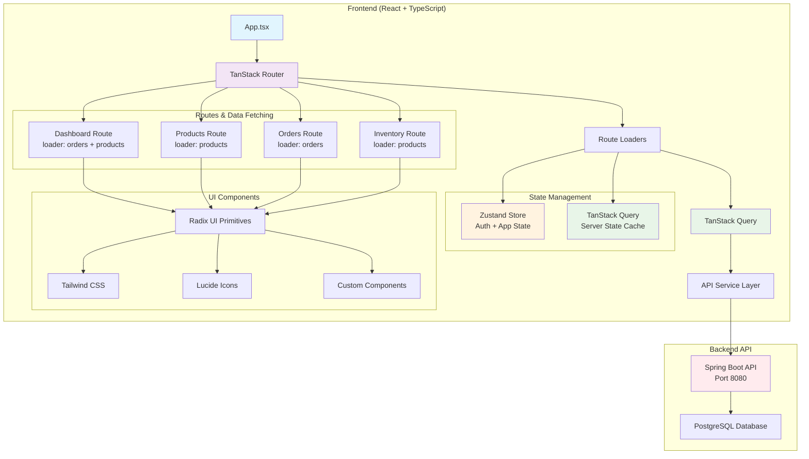
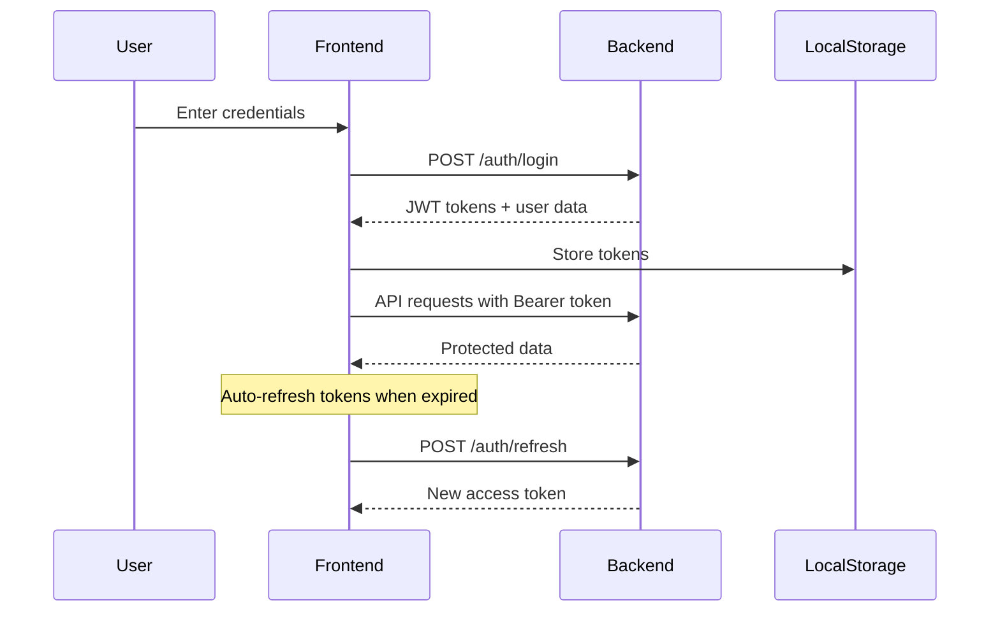

# OrderFlow - Frontend

A modern React-based order management system frontend built with TypeScript, TanStack Router, and TanStack Query.

## 🏗️ Architecture



## 🚀 Features

- **Modern Architecture**: Built with TanStack Router for type-safe routing and data fetching
- **Server State Management**: TanStack Query handles caching, synchronization, and background updates
- **Authentication**: JWT-based authentication with automatic token validation
- **Real-time Dashboard**: Business metrics, low stock alerts, and recent order tracking
- **Product Management**: Complete CRUD operations for inventory management
- **Order Processing**: View customer orders with detailed product information
- **Shopping Cart**: Add products to cart and create orders
- **Responsive Design**: Mobile-first design with Tailwind CSS
- **Type Safety**: Full TypeScript implementation with strict typing

## 🛠️ Tech Stack

### Core
- **React 19** - Latest React with concurrent features
- **TypeScript 5.9** - Type-safe JavaScript
- **Vite 7** - Fast build tool and development server

### Routing & Data Fetching
- **TanStack Router 1.139** - Type-safe routing with loaders
- **TanStack Query 5.90** - Server state management and caching
- **TanStack Table 8.21** - Headless table library for data display

### UI & Styling
- **Tailwind CSS 4.1** - Utility-first CSS framework
- **Radix UI** - Accessible component primitives
- **Lucide React** - Beautiful icons
- **Tailwind Animate** - CSS animations

### State Management
- **Zustand 5.0** - Lightweight state management for app state
- **TanStack Query** - Server state and caching

## 📁 Project Structure

```
src/
├── components/
│   ├── ui/                 # Reusable UI components (buttons, cards, etc.)
│   ├── layout/            # Layout components (Header, Sidebar)
│   └── ...                # Feature-specific components
├── routes/                # TanStack Router route definitions
│   ├── __root.tsx        # Root layout route
│   ├── index.tsx         # Dashboard route (/)
│   ├── products.tsx      # Products route (/products)
│   ├── orders.tsx        # Orders route (/orders)
│   └── inventory.tsx     # Inventory route (/inventory)
├── hooks/                # Custom React hooks
├── services/             # API service layer
├── store/                # Zustand stores
├── types/                # TypeScript type definitions
└── utils/                # Utility functions
```

## 🔄 Data Fetching Strategy

The app uses **TanStack Router loaders** for efficient data fetching:

```typescript
// Route with loader - fetches data on navigation
export const Route = createFileRoute('/products')({
  loader: ({ context }) => {
    return context.queryClient.fetchQuery({
      queryKey: ['products', { page: 0, size: 20 }],
      queryFn: () => apiService.getProducts({ page: 0, size: 20 }),
      staleTime: 0, // Force refetch on every navigation
    })
  },
  component: Products,
})
```

### Benefits:
- ✅ **Data fetching happens on route navigation**, not component mount
- ✅ **Automatic refetching** when navigating to pages
- ✅ **Parallel data loading** for routes that need multiple data sources
- ✅ **Type-safe loaders** with full TypeScript support
- ✅ **Background updates** and caching via TanStack Query

## 🚦 Getting Started

### Prerequisites
- Node.js 18+ 
- npm or yarn
- Backend API running on `http://localhost:8080`

### Installation

1. **Clone the repository**
   ```bash
   cd order-management-system/frontend
   ```

2. **Install dependencies**
   ```bash
   npm install
   ```

3. **Set environment variables**
   ```bash
   # Create .env.local file
   VITE_API_BASE_URL=http://localhost:8080/api
   ```

4. **Start development server**
   ```bash
   npm run dev
   ```

   The app will be available at `http://localhost:5173`

### Build for Production

```bash
npm run build
```

## 📋 Available Scripts

| Script | Description |
|--------|-------------|
| `npm run dev` | Start development server with HMR |
| `npm run build` | Build for production |
| `npm run preview` | Preview production build locally |
| `npm run lint` | Run ESLint |
| `npm run format` | Format code with Prettier |
| `npm run format:check` | Check code formatting |

## 🔐 Authentication Flow



## 🏃‍♂️ Development Workflow

### Route-based Data Fetching
1. **Create route file** in `/src/routes/`
2. **Add loader function** for data fetching
3. **Use `useLoaderData`** in component to access data
4. **TanStack Query** handles caching automatically

### Adding New Features
1. **Define types** in `/src/types/`
2. **Create API methods** in `/src/services/api.ts`
3. **Build UI components** in `/src/components/`
4. **Add routes** with loaders for data fetching
5. **Update navigation** in sidebar if needed

## 🔧 Configuration

### TanStack Router
Route generation happens automatically via the Vite plugin. Route files in `/src/routes/` are processed to create type-safe routing.

### TanStack Query
Global configuration in `App.tsx`:
```typescript
const queryClient = new QueryClient({
  defaultOptions: {
    queries: {
      staleTime: 5 * 60 * 1000, // 5 minutes
      gcTime: 10 * 60 * 1000,   // 10 minutes
      retry: 1,
      refetchOnWindowFocus: false,
    },
  },
})
```

## 🎯 Performance Features

- **Route-based code splitting** with TanStack Router
- **Optimistic updates** for better UX
- **Background data synchronization** 
- **Intelligent caching** with TanStack Query
- **Minimal re-renders** with Zustand
- **Tree shaking** with Vite

## 🧪 Testing

Currently using placeholder test commands. To implement testing:

```bash
# Install testing dependencies
npm install -D @testing-library/react @testing-library/jest-dom vitest jsdom

# Run tests
npm run test
```

## 🤝 Contributing

1. Create feature branch from `main`
2. Follow TypeScript strict mode
3. Use existing component patterns
4. Add proper error handling
5. Update types as needed
6. Test in both development and production builds

## 📝 API Integration

The frontend communicates with a Spring Boot backend via RESTful APIs:

- **Products API**: CRUD operations for product management
- **Orders API**: Order creation and management
- **Users API**: Authentication and user management
- **Cart API**: Shopping cart calculations

See `/src/services/api.ts` for complete API documentation.

## 🔍 Monitoring

- **React Query Devtools** for inspecting queries and cache
- **React Developer Tools** for component debugging
- **Console logging** for API requests and errors
- **Error boundaries** for graceful error handling

---

Built with ❤️ using modern React patterns and TanStack ecosystem.